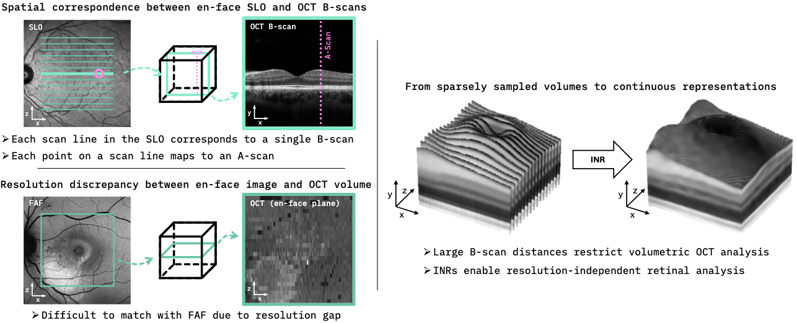
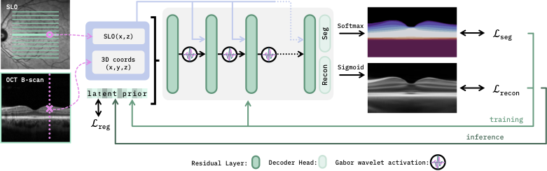
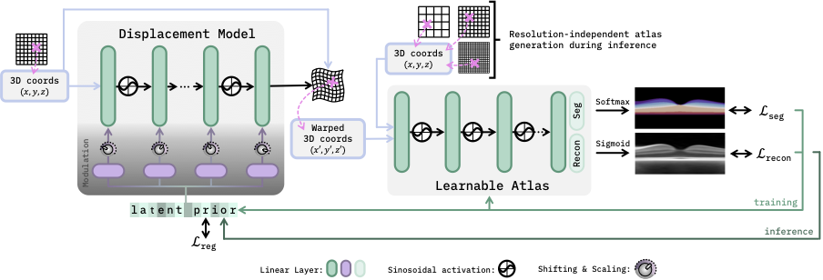

# Don't Mind the Gaps: Implicit Neural Representations for Resolution-Agnostic Retinal OCT Analysis

This repository contains the implementation for the paper:

> **[Don't Mind the Gaps: Implicit Neural Representations for Resolution-Agnostic Retinal OCT Analysis](https://arxiv.org/abs/2601.02447)**  
> Bennet Kahrs*, Julia Andresen* , Fenja Falta, Monty Santarossa, Heinz Handels, Timo Kepp  
> *[MELBA Special Issue](https://www.melba-journal.org/issues/bvm25.html) (German Conference on Medical Image Computing 2025)<br>
> *-- Preprint under review, 2026*  
> \* Equal contribution

----
This work extends our conference paper presented at the German Conference on Medical Image Computing 2025 (Bildverarbeitung für die Medizin, BVM), which received the Third Best Paper Award 🥉:

📄 **Conference Paper:** [Bridging Gaps in Retinal Imaging - Fusing OCT and SLO Information with Implicit Neural Representations for Improved Interpolation and Segmentation](https://link.springer.com/chapter/10.1007/978-3-658-47422-5_24)  
🧑‍💻 **GitHub Repo:** [github.com/tkepp/INteRp-OCT](https://github.com/tkepp/INteRp-OCT)
---

This work explores implicit neural representations (INRs) as a resolution-agnostic alternative for dense
three-dimensional analysis of retinal optical coherence tomography (OCT) data. INRs represent voxelized volumes as
continuous functions over spatial coordinates, enabling consistent volumetric predictions even for anisotropic inputs.



Within this repository, we present two INR-based frameworks:

1) Anisotropic B-scan interpolation, which integrates information from two modalities to preserve anatomical structures 
between sparsely sampled slices.
2) A resolution-independent retinal atlas, enabling general analysis without strict assumptions about image resolution 
or acquisition protocol. 

Both approaches leverage population-based training to learn generalizable retinal representations and support
inference on unseen data. Together, these methods enable robust volumetric analysis of OCT volumes with large
B-scan spacing and open new possibilities for 3D assessment of retinal structure and pathology.

## Prerequisites
- Linux 20.04
- Python 3.9
- NVIDIA GPU + CUDA CuDNN

### Packages
- PyTorch (2.1)
- numpy
- json
- SimpleITK
- SciPy
- ruamel
- yaml
- matplotlib
- lpips
- scikit-image
- monai
- lightning
- wandb
- tqdm


## Getting Started
### Installation
- Clone this repository
- Install the necessary requirements

### Repository Structure

```
.
├── images/                     # images for this repo 
├── anisotropic interpolation/  # Source code for anisotropic interpolation
    ├── configs/                    # config files 
    ├── evaluations/                # scripts to run evaluations
    ├── model/                      # pytorch model architectures
├── atlas registration/         # Source code for atlas registration
    ├── architectures/              # pytorch model architectures 
    ├── datasets/                   # dataset classes 
    ├── experiments/                # scripts for experiments
    ├── routines/                   # pytorch lightning training scripts  
    ├── utilities/                  # helper functions 
└── README.md

```

### Dataset
The same dataset as provided in the [INteRp-OCT](https://github.com/tkepp/INteRp-OCT) repository is used in
this work and consists of 100 OCT and SLO image
pairs from 50 healthy volunteers (right and left eye), acquired with a Heidelberg Spectralis scanner. OCT volumes
and corresponding SLO images have resolutions of 496 $\times$ 512 $\times$ 512 (dense OCTA sampling) and
768 $\times$ 768, respectively.

### Preprocessing
Depending on the task, different preprocessing steps are applied to the OCT data for interpolation and registration:
- Flattening at the Bruch's membrane
- B-scan-wise normalization to \[0,1\]
- Cropping of B-scans to size 230x496 
- Subsampling to 16 equidistant B-scans (interpolation only)

Resolution of OCT images used for training:

interpolation &rarr; 230x496x16
registration &rarr; TBA 

En face (SLO and FAF) image pre-processing (interpolation only):
- Subsampling to B-Scan positions (of original OCT volume)
- Normalization to \[0,1\]
- Cropping and subsampling

&rarr; Resolution of SLO images used for training is 496x16

Data format (interpolation only):
For each fold, we organized our training and test images in .npz-files named
'dataset_flat_subsmpl32_train_fold{config.SETTINGS.FOLD}.npz'. For evaluation purposes, we used images 
sampled to 31 B-scans which are stored as 'dataset_flat_subsmpl16_test_fold{config.SETTINGS.FOLD}.npz'.
For our code to work, each .npz-container must have the following components:
- 'oct_vols': The training/test images in format \[num_samples, H, W, D\]
- 'seg_vols': The corresponding segmentation images in format \[num_samples, H, W, D\]
- 'enface_imgs': The corresponding en face images (SLO, FAF, ...) in format \[num_samples, W, D\]
- 'subject_names': A list containing identifiers of your data
- 'spacing_oct': The corresponding voxel spacings of the OCT scans in the format \[X,Y,Z\].

If you want to use a different data format, the following lines of code need to be adapted:
- In train_test_geninr.py: Lines 67 - 71, 213 - 230, 256-257
- In training.py: Lines 187 - 189
- In evaluation.py: Lines 302 - 306 

## Anisotropic Interpolation

|                                            |
|:-----------------------------------------------------------------------:|
|     *Schematic overview of the anisotropic interpolation framework*     |

## Usage
We provide two main scripts: one for training the proposed generalizable INR and subsequently fitting it to test 
images, and one for fitting an INR to individual OCT–SLO image pairs. Both scripts additionally perform model evaluation.

Once all paths have been added to the configuration, the interpolation can be executed using the following commands:

```bash
python train_test_geninr.py configs/geninr_config.yaml --gpu 0
```
```bash
python train_test_singleinr.py configs/singleinr_config.yaml --gpu 0
```

## Atlas Registration

|                                      |
|:--------------------------------------------------------------:|
|     *Schematic overview of the atlas generation framework*     |

### Usage
Once all paths have been added to the configuration, the atlas registration can be executed using: 
```bash
python GINR_Atlas_base.py configs/fit_GINR_Atlas_base.yml
```


## Citation
This repository provides the code for the journal extension of our [conference paper](https://link.springer.com/chapter/10.1007/978-3-658-47422-5_24).
If you use this code, please cite the corresponding journal article as follows:
```
@article{mindGaps2026,
  title={Don't Mind the Gaps: Implicit Neural Representations for Resolution-Agnostic Retinal OCT Analysis},
  author={Bennet Kahrs and Julia Andresen and Fenja Falta and Monty Santarossa and Heinz Handels and Timo Kepp},
  journal={arXiv preprint arXiv:2601.02447},
  year={2026}
}
```
